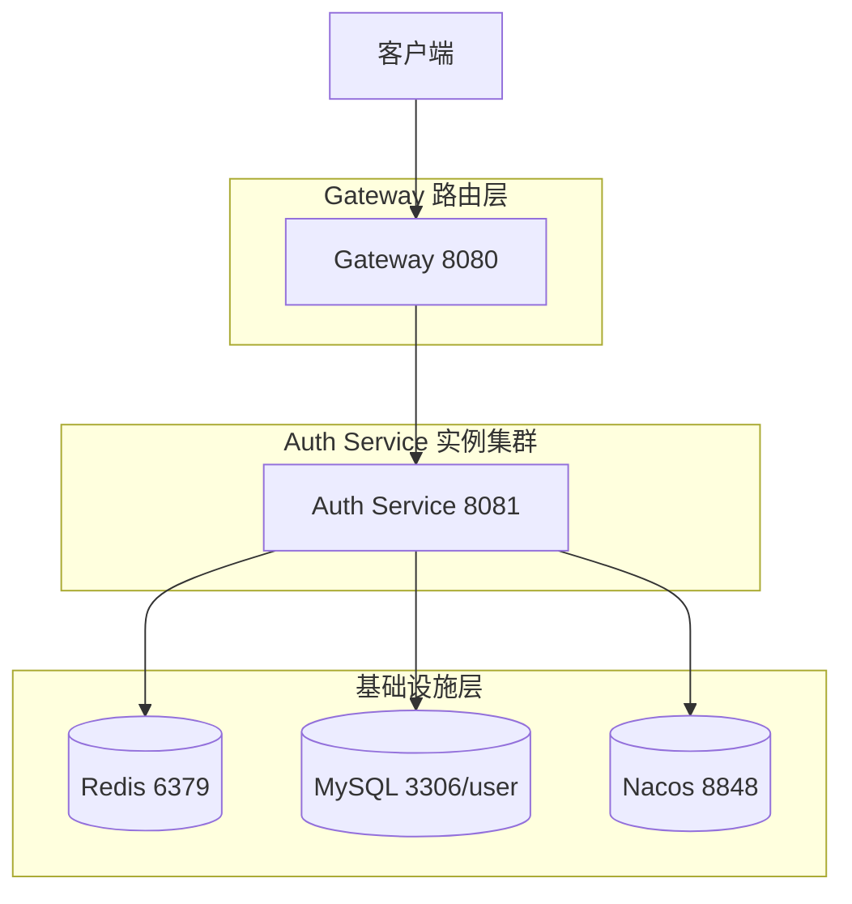

# Auth 服务架构设计解析

## 🎯 核心设计原则

Auth 服务采用 **"无状态 + 缓存 + 注册中心"** 的经典分布式微服务设计，实现高并发、高性能、高可用。

---

## 📐 整体架构图



---

## 🔍 分布式特性详解

### 1. **服务注册与发现** (高可用基础)

**配置** (`application.yaml`):
```yaml
spring:
  cloud:
    nacos:
      discovery:
        server-addr: ${NACOS_ADDR:nacos:8848}
        namespace: dev
        group: DEFAULT_GROUP
        service: ${spring.application.name}
```

**作用**:
- ✅ **实例自动注册**: 服务启动时向 Nacos 上报元数据（IP、端口、健康状态）
- ✅ **动态发现**: Gateway 通过 Nacos 获取所有 auth 实例列表
- ✅ **负载均衡**: Gateway + Ribbon 轮询调用不同实例
- ✅ **故障剔除**: Nacos 健康检查失败自动移除实例（默认 5s 检查）
- ✅ **多环境隔离**: `namespace: dev` 隔离开发/测试/生产环境

**高可用体现**:
- Nacos 集群（≥3节点）避免单点故障
- 多个 auth 实例同时在线，单实例宕机不影响服务

---

### 2. **无状态设计 + JWT** (水平扩展核心)

**传统 Session 问题**:
- ❌ 需要会话复制（Session Replication）或共享存储（Session Store）
- ❌ 实例间依赖强，扩缩容复杂
- ❌  sticky session（会话粘滞）导致负载不均

**JWT 解决方案**:
```java
String token = JwtUtil.generateToken(
    userId, username, role, jwtSecret, jwtExpirationMs
);
```

**优势**:
- ✅ **完全无状态**: 任意实例都能验证 token，无需共享 session
- ✅ **极速验证**: 本地计算签名，无需查库（99%场景）
- ✅ **水平扩展**: 新实例启动即服务，无需数据迁移
- ✅ **跨域友好**: token 可跨子域、跨系统使用（如 Gateway + 各服务）

**注意**:
- JWT payload 不存敏感信息（只放 userId、username、role）
- 签名密钥 `jwt.secret` 需强随机且所有实例一致（生产用环境变量或 Nacos Config）

---

### 3. **Redis 缓存策略** (高性能关键)

**应用场景**:
1️⃣ **JWT 黑名单**（登出回收）
2️⃣ **分布式锁**（防并发重复登录）
3️⃣ **用户会话缓存**（可选，减少 DB 查詢）

**黑名单实现**:
```java
public String login(...) {
    String token = JwtUtil.generateToken(...);
    String jti = JwtUtil.getJti(token, jwtSecret);  // 唯一ID
    String redisKey = "auth:logout:" + jti;
    // 登出前有效期内标记为已注销
    redisTemplate.opsForValue().set(redisKey, "1", Duration.ofMillis(jwtExpirationMs));
    return token;
}

public User validateToken(String token) {
    String jti = JwtUtil.getJti(token, jwtSecret);
    String redisKey = "auth:logout:" + jti;
    // O(1) 检查是否在黑名单
    if (Boolean.TRUE.equals(redisTemplate.hasKey(redisKey))) {
        throw new RuntimeException("Token 已失效");
    }
    // ...继续验证签名、查库
}
```

**性能对比**:
| 方案 | 登出响应时间 | 验证开销 | 缺点 |
|------|------------|----------|------|
| 无黑名单（仅过期） | 即时生效 | 仅签名验证 | 无法强制登出 |
| DB 标记黑名单 | 10-50ms | 每次验证都查DB | DB 压力大 |
| Redis 黑名单 | 0.1-1ms | O(1) 内存查询 | Redis 单点（可集群） |

**Redisson 高级特性**（未来可用）:
- 分布式锁：`RLock lock = redisson.getLock("login:" + username)`
- 限流器：`RRateLimiter limiter = redisson.getRateLimiter("login.limiter")`
- 阻塞队列：异步任务

---

### 4. **数据库设计** (数据一致性与扩展性)

**表结构** (`users`):
```sql
CREATE TABLE users (
    id BIGINT PRIMARY KEY AUTO_INCREMENT,
    username VARCHAR(50) UNIQUE NOT NULL,
    email VARCHAR(100) UNIQUE,
    phone VARCHAR(20) UNIQUE,
    password_hash VARCHAR(255) NOT NULL,
    status TINYINT DEFAULT 1 COMMENT '0-禁用,1-正常',
    role VARCHAR(20) DEFAULT 'user',
    balance DECIMAL(10,2) DEFAULT 0.0,
    created_at DATETIME DEFAULT NOW(),
    updated_at DATETIME DEFAULT NOW() ON UPDATE NOW(),
    version INT DEFAULT 0 COMMENT '乐观锁版本'
);
```

**分布式特性**:
- ✅ **唯一索引**: username/email/phone 天然防重，跨实例查询无冲突
- ✅ **乐观锁**: `version` 字段防止并发修改用户信息
- ✅ **读写分离**（可扩展）: 写主库，读从库（Spring AbstractRoutingDataSource）
- ✅ **分库分表**（未来）: 按 `id % 16` 分16库，Nacos 配置动态路由

**连接池** (Druid):
```yaml
spring:
  datasource:
    # Druid 自动配置（Spring Boot 3 + druid-spring-boot-3-starter）
    # 默认配置:
    # max-active: 20
    # min-idle: 5
    # max-wait: 60000
```
- **复用连接**: 避免频繁建立 TCP + SSL 握手
- **并发控制**: 限制最大连接数，防 DB 压力过大
- **泄漏检测**: 自动回收未关闭的连接

---

### 5. **安全设计** (认证授权)

**密码存储**:
```java
@Bean
public BCryptPasswordEncoder passwordEncoder() {
    return new BCryptPasswordEncoder(12); // strength=12
}

// 注册
String hash = passwordEncoder.encode(rawPassword);
// 登录
boolean matches = passwordEncoder.matches(rawPassword, storedHash);
```

**BCrypt 优势**:
- 自适应成本：硬件越好，破解越慢（12轮迭代 ≈ 200-500ms）
- 内置 salt：防止彩虹表攻击
- 单向哈希：不可逆

**JWT 防篡改**:
```java
// 签名算法: HMAC-SHA256
String signature = HMACSHA256(base64(header) + "." + base64(payload), secret);
// 验证时重新计算签名对比
```

**令牌黑名单**:
- 登出立即写入 Redis，后续验证拦截
- TTL 与 JWT 过期时间一致，避免内存泄漏

**请求校验**:
```java
@PostMapping("/login")
public ResponseEntity<?> login(
    @RequestParam @NotBlank String username,  // 自动校验非空
    @RequestParam @NotBlank String password) { ... }
```

---

### 6. **限流与熔断** (Sentinel 集成)

**配置**:
```xml
<!-- pom.xml -->
<dependency>
    <groupId>com.alibaba.cloud</groupId>
    <artifactId>spring-cloud-starter-alibaba-sentinel</artifactId>
</dependency>
```

**代码示例**:
```java
@RestController
public class AuthController {
    @SentinelResource(
        value = "login",
        blockHandler = "loginBlock",  // 限流降级处理
        fallback = "loginFallback     // 异常回退
    )
    @PostMapping("/login")
    public String login(...) { ... }

    // 限流触发时调用
    public String loginBlock(String username, String password, BlockException ex) {
        return Result.error(429, "登录过于频繁，请稍后重试");
    }
}
```

**Sentinel Dashboard 规则**（动态配置，无需重启）:
- **流控规则**: QPS=10/用户，或每秒 100 次全局
- **熔断规则**: 错误率 > 50% 持续 5s，熔断 10s
- **热点参数**: `username` 为热点，单用户限流，防密码爆破

**高可用体现**:
- 网关层 + 服务层双层限流，防御层层递进
- 实时监控：Sentinel Dashboard 看板展示 QPS、RT、拒绝数
- 规则持久化：规则推送到 Nacos，所有实例同步

---

### 7. **性能优化点**

| 优化项 | 当前实现 | 可提升空间 |
|--------|----------|-----------|
| **缓存策略** | Redis 黑名单 | 缓存 UserDTO（5min TTL），减少 DB 查詢 |
| **DB 索引** | username/email/phone UK | 复合索引 `(status, username)` 加速登录查询 |
| **连接池** | Druid 默认 (20) | 根据压测调整：maxActive=50, minIdle=10 |
| **JWT 解析** | 每次验证解析 payload | Redis 短期缓存 JWT 解析结果（jti → userId） |
| **序列化** | Jackson JSON | Fastjson2 或 Protobuf（体积小 50%） |
| **线程模型** | Spring MVC (Tomcat) | 评估 WebFlux（响应式）在高并发登录场景 |

**压测建议**: `wrk -t12 -c100 -d30s http://localhost:8081/api/auth/login`

---

### 8. **可观测性** (Observability)

**日志**:
```yaml
logging:
  level:
    com.whu.serviceauth: DEBUG  # 业务日志
    org.springframework.cloud: INFO  # 框架日志
```

**关键日志点**:
- `register: username=xxx, email=xxx` → 审计注册行为
- `login: username=xxx, duration=35ms` → 性能监控
- `validate: userId=xxx, jti=xxx` → 追踪 token 验证

**Spring Boot Actuator**（需添加 `spring-boot-starter-actuator`）:
```
GET /actuator/health          # 健康状态
GET /actuator/metrics         # JVM、DB、HTTP 指标
GET /actuator/metrics/jvm.memory.used
GET /actuator/prometheus      # Prometheus 格式
```

**网关 + 链路追踪**（未来）:
- Zipkin / SkyWalking：traceId 贯穿 Gateway → Auth → DB
- 定位慢请求：登录延迟 2s → 是 DB 慢查询还是 Redis 问题

---

### 9. **横向扩展能力** (Scale Out)

**扩容操作**:
1. 启动第二个实例: `java -jar service-auth.jar --server.port=8081`
2. Nacos 控制台看到两个实例（`192.168.1.10:8081`, `192.168.1.11:8081`）
3. Gateway Ribbon 自动负载均衡（轮询/随机）

**数据分片**（超高并发未来）:
```sql
-- 按 user_id 前两位分库 (sharding)
user_00, user_01, ... user_99
-- 配置 MyCat 或 ShardingSphere
```
- Nacos 配置动态路由，新的分库无需重启服务

---

### 10. **容错与降级** (Resilience)

**场景**: Redis 宕机（5% 概率）
- **当前行为**: 所有 token 验证失败（黑名单查不到）→ 登录不了
- **降级方案**: 捕获 Redis 异常，跳过黑名单检查（仅签名验证 + DB 查用户）
  - 风险：已登出用户仍能访问（至多 2 小时，直到 token 过期）
  - 收益：核心认证功能可用

**场景**: MySQL 慢查询
- **Sentinel 熔断**: 错误率过高触发熔断，返回「服务暂时不可用」
- **缓存兜底**: 查询用户信息走 Redis，DB 压力减少 80%

**场景**: Nacos 不可用
- **本地缓存**: Spring Cloud Alibaba 内置 Nacos 客户端缓存
- **服务间直连**: 如果已知 IP，可配 `nacos.discovery.ip` 跳过 Nacos

---

## ✅ 分布式特性总结

| 特性 | 实现方案 | 关键技术 |
|------|----------|----------|
| **去中心化** | 独立服务，独立 DB | 微服务拆分 |
| **无状态** | JWT 令牌 | 签名验证，不存会话 |
| **服务发现** | Nacos | 自动注册、健康检查 |
| **负载均衡** | Gateway + Ribbon | 轮询、权重 |
| **缓存加速** | Redis 黑名单 | 内存 O(1) |
| **熔断降级** | Sentinel | QPS 限流、错误熔断 |
| **配置外置** | Nacos Config（可扩展） | 动态刷新 |
| **安全** | BCrypt + JWT | 防爆破、防篡改 |
| **横向扩展** | 多实例、水平扩展 | 无状态设计 |
| **可观测** | Actuator + 日志 | 健康检查、监控 |

---

## 🚀 生产级增强建议

1. **Nacos 集群**: ≥3 节点，Raft 协议保证 CP
2. **Redis 集群**: Sentinel（一主两从）或 Cluster（分片）
3. **MySQL 读写分离**: 一主多从 + MyCat
4. **JWT 密钥管理**: K8s Secret / 环境变量，定期轮换
5. **监控告警**: Prometheus + AlertManager（Redis 内存 > 80% 告警）
6. **安全加固**:
   - 登录验证码（防机器爆破）
   - 多因素认证（短信/邮件验证码）
   - API 签名（防重放攻击）
7. **压测与调优**:
   - 单实例 QPS 目标: 5000+ 登录/秒
   - P99 延迟: < 100ms
   - 连接池: `maxActive=50`, `maxWait=3000`

---

**🦞 这就是一个标准的云原生认证服务——麻雀虽小，五脏俱全。**

需要我继续画更详细的部署拓扑图，或者分析其他服务（product/cart/order）的分布式设计吗？
