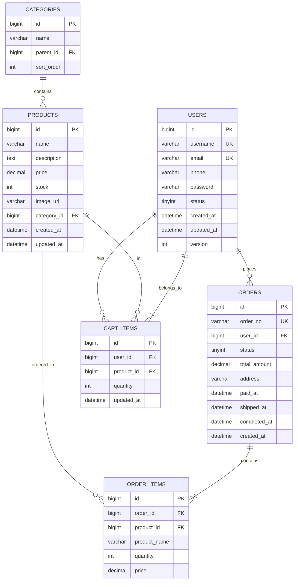

# 数据库ER图（Mermaid）

---

# 库表清单

## 1. `users` 用户表
| 字段 | 类型 | 说明 |
|------|------|------|
| id | BIGINT PK | 自增主键 |
| username | VARCHAR(50) UK | 用户名 |
| email | VARCHAR(100) UK | 邮箱 |
| phone | VARCHAR(20) | 手机号 |
| password | VARCHAR(255) | 密码（加密） |
| status | TINYINT | 状态 0-禁用 1-正常 |
| created_at | DATETIME | 创建时间 |
| updated_at | DATETIME | 更新时间 |
| version | INT | 乐观锁版本 |

## 2. `products` 商品表
| 字段 | 类型 | 说明 |
|------|------|------|
| id | BIGINT PK | 自增主键 |
| name | VARCHAR(200) | 商品名称 |
| description | TEXT | 商品描述 |
| price | DECIMAL(10,2) | 价格 |
| stock | INT | 库存 |
| image_url | VARCHAR(500) | 主图地址 |
| category_id | BIGINT FK | 分类ID |
| created_at | DATETIME | 创建时间 |
| updated_at | DATETIME | 更新时间 |

## 3. `categories` 类目表（自关联）
| 字段 | 类型 | 说明 |
|------|------|------|
| id | BIGINT PK | 自增主键 |
| name | VARCHAR(100) | 类目名称 |
| parent_id | BIGINT FK | 父类目ID（null为一级） |
| sort_order | INT | 排序权重 |

## 4. `orders` 订单表
| 字段 | 类型 | 说明 |
|------|------|------|
| id | BIGINT PK | 自增主键 |
| order_no | VARCHAR(64) UK | 订单号（分布式ID生成，如雪花） |
| user_id | BIGINT FK | 用户ID |
| status | TINYINT | 订单状态（0待支付 1已支付 2已发货 3已完成 4已取消） |
| total_amount | DECIMAL(10,2) | 订单总金额 |
| address | VARCHAR(500) | 收货地址 |
| paid_at | DATETIME | 支付时间 |
| shipped_at | DATETIME | 发货时间 |
| completed_at | DATETIME | 完成时间 |
| created_at | DATETIME | 创建时间 |

## 5. `order_items` 订单项表
| 字段 | 类型 | 说明 |
|------|------|------|
| id | BIGINT PK | 自增主键 |
| order_id | BIGINT FK | 订单ID |
| product_id | BIGINT FK | 商品ID |
| product_name | VARCHAR(200) | 下单时商品名称快照（防止后续商品改名） |
| quantity | INT | 购买数量 |
| price | DECIMAL(10,2) | 下单时单价快照 |

## 6. `cart_items` 购物车表
| 字段 | 类型 | 说明 |
|------|------|------|
| id | BIGINT PK | 自增主键 |
| user_id | BIGINT FK | 用户ID |
| product_id | BIGINT FK | 商品ID |
| quantity | INT | 数量 |
| updated_at | DATETIME | 更新时间（用于清理过期购物车） |

---

**🦞 注意**：各微服务在本项目中分库：
- `auth` 服务：使用 `ecommerce_auth`（含 `users`）
- `product` 服务：使用 `ecommerce_product`（含 `products`, `categories`）
- `order` 服务：使用 `ecommerce_order`（含 `orders`, `order_items`）
- `cart` 服务：建议用 Redis，若持久化可建 `ecommerce_cart`（含 `cart_items`）